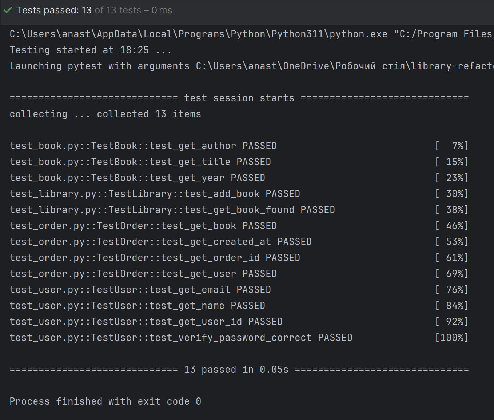
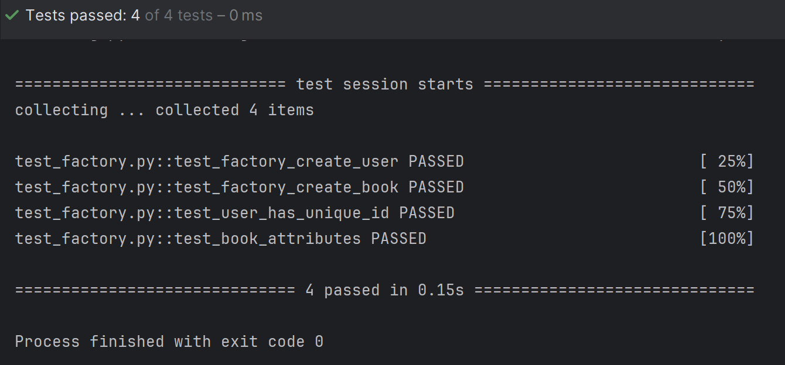
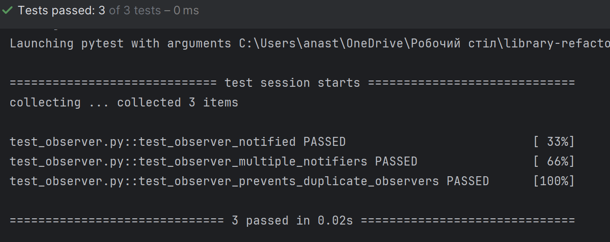
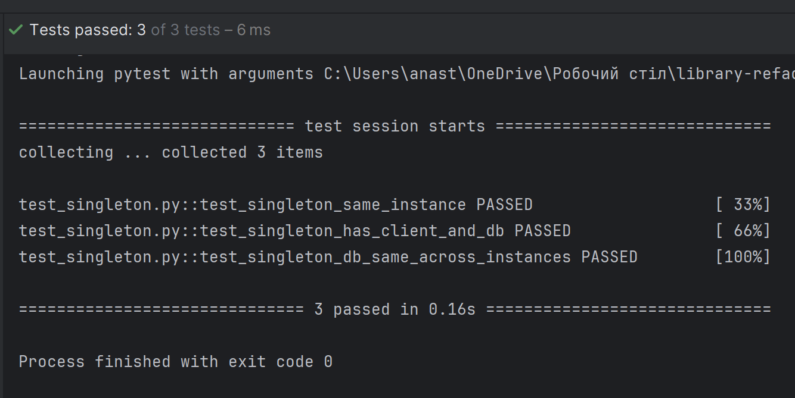

# Лабораторна робота 5  
## Розробка бібліотечного сервісу з використанням TDD та шаблонів проектування

## Завдання

### Частина 1: Проектування бібліотечного сервісу

#### Аналіз проблеми та дизайн
- **Основні класи системи:**
  - `Library`: представляє бібліотеку, що містить колекцію книг.
  - `Book`: представляє книгу з атрибутами (назва, автор, рік).
  - `User`: представляє користувача бібліотеки.
  - `Order`: представляє замовлення книги користувачем.
  - `OrderNotifier`: сповіщає бібліотекаря про нові замовлення.

#### Завдання:
- Розробіть **UML-діаграму класів**, яка відображає відносини між класами та їхні обов’язки.
- Реалізуйте початкову версію класів у пакеті  з ізоляцією бізнес-логіки від зовнішніх систем.

##  UML-діаграма

### Зв'язки агрегації (◇→)

1. **Library ◇→ Book**: Клас Library містить колекцію об'єктів класу Book (contains). Бібліотека містить книги, але книги можуть існувати незалежно від конкретної бібліотеки.

### Зв'язки асоціації (звичайна стрілка)

1. **OrderNotifier ← Order**: Клас OrderNotifier спостерігає за класом Order (observes). OrderNotifier отримує повідомлення про зміни в замовленні і реагує на них.
2. **Order → Book**: Клас Order містить посилання на Book. Замовлення включає книгу, яку замовив користувач.
3. **Order → User**: Клас Order посилається на User. Замовлення пов'язане з користувачем, який його створив.
4. **User ← Order**: Клас User створює об'єкти Order. Користувач може створювати замовлення в системі.

### Частина 2: Розробка системи за допомогою TDD

#### Реалізація функціоналу через TDD:
1. Почніть із модульних тестів для кожної функції перед реалізацією.
   
2. **Функціонал для тестування:**
   - Додавання книг до бібліотеки.
   - Реєстрація користувачів.
   - Створення замовлення книги.
   - Сповіщення бібліотекаря про нове замовлення.

3. Реалізуйте функціональність так, щоб тести проходили успішно.

#### Тестуйте різні сценарії:

- Реалізувати мінімум 10 модульних тестів для основних функцій і взаємодій.
* Успішне та неуспішне додавання книг.
* Обробка замовлень.
* Ситуації з порожньою бібліотекою або незареєстрованим користувачем.

#### Реалізовані тести

##### `test_book.py`

Тести для класу **Book**:

* **test\_get\_title** — перевіряє, чи метод `get_title()` повертає правильну назву книги.
* **test\_get\_author** — перевіряє, чи метод `get_author()` повертає правильного автора.
* **test\_get\_year** — перевіряє, чи метод `get_year()` повертає правильний рік видання.

##### `test_library.py`

Тести для класу **Library**:

* **test\_add\_book** — перевіряє, чи книга правильно додається до бібліотеки.
* **test\_get\_book\_found** — перевіряє пошук книги, яка є в бібліотеці.
* **test\_get\_book\_not\_found** — перевіряє пошук книги, якої немає (повинен повертати `None`).

##### `test_order.py`

Тести для класу **Order**:

* **test\_get\_order\_id** — перевіряє, чи повертається правильний ID замовлення.
* **test\_get\_user** — перевіряє, чи повертається правильний користувач замовлення.
* **test\_get\_book** — перевіряє, чи повертається правильна книга замовлення.
* **test\_get\_created\_at** — перевіряє, що дата створення замовлення повертається у правильному форматі (`datetime`).

##### `test_user.py`

Тести для класу **User**:

* **test\_get\_user\_id** — перевіряє правильність повернення ID користувача.
* **test\_get\_name** — перевіряє правильність повернення імені користувача.
* **test\_get\_email** — перевіряє правильність повернення email користувача.
* **test\_verify\_password\_correct** — перевіряє правильну перевірку пароля (коли пароль правильний).
* **test\_verify\_password\_incorrect** — перевіряє неправильну перевірку пароля (коли пароль невірний).

##### Результат тестів після реалізації логіки методів

### Частина 3: Використання шаблонів проектування

#### Застосовуйте шаблони:

* **Singleton:** для керування єдиним підключенням до MongoDB.
* **Factory:** для створення об’єктів `Book` і `User`.
* **Шаблон Observer:** для сповіщення бібліотекаря про нові замовлення.

#### Напишіть тести для шаблонів:

- Реалізувати мінімум 10 тестів для реалізації шаблонів.
* Перевірка, що Singleton повертає єдиний екземпляр.
* Тести для Factory: створення правильних об’єктів.
* Тести для Observer: перевірка сповіщення бібліотекаря.

## Тести для патернів проєктування

### **Factory Method Tests** (тести для фабрики `UserFactory` та `BookFactory`)

* **`test_user_factory_creates_user_correctly`**
  Перевіряє, що фабрика `UserFactory` створює користувача з правильними ім’ям, поштою та хешованим паролем.

* **`test_book_factory_creates_book_correctly`**
  Переконується, що фабрика `BookFactory` створює книгу з вказаними назвою, автором та роком видання.

* **`test_user_factory_unique_ids`**
  Тестує, що при створенні кількох користувачів фабрика генерує **унікальні** ідентифікатори (ID).

* **`test_book_factory_unique_ids`**
  Аналогічно перевіряє, що при створенні кількох книг їхні ID також є унікальними.

### **Observer Pattern Tests** (тести для `OrderNotifier` та `Librarian`)

* **`test_observer_notifies_librarian`**
  Перевіряє, що при виклику `notify()` спостерігач (лібріаріан) отримує повідомлення.

* **`test_observer_multiple_librarians`**
  Переконується, що кілька бібліотекарів отримують сповіщення одночасно, якщо зареєстровані як спостерігачі.

* **`test_observer_removes_observer_correctly`**
  Тестує, що після видалення спостерігача з `OrderNotifier`, він більше не отримує сповіщення.

* **`test_observer_prevents_duplicate_observers`**
  Перевіряє, що `OrderNotifier` не додає одного і того ж спостерігача двічі, тим самим запобігає дублюванню сповіщень.

### **Singleton Pattern Tests** (тести для `MongoConnection`)

* **`test_singleton_returns_same_instance`**
  Перевіряє, що кілька викликів `MongoConnection()` повертають **один і той самий об’єкт** (перевірка Singleton-поведінки).

* **`test_singleton_connection_string`**
  Тестує, що у об'єкта `MongoConnection` зберігається правильний рядок підключення до бази даних MongoDB.

## Технічні вимоги

* **Мова програмування:** Python
* **Фреймворк для тестування:** pytest
* **База даних:** MongoDB
* **Бібліотека для роботи з MongoDB:** PyMongo
* **Інші технології:** Flask для RESTful API

## Вимоги

### Код системи:

* Реалізуйте класи та функціонал відповідно до структури **Domain, Ports, Adapters**.
* Використовуйте **TDD** для розробки.
* Застосовуйте шаблони **Singleton, Factory, Observer**.

### Тестування:

* Напишіть **щонайменше 10 модульних тестів** для перевірки:

  * Основних функцій (додавання книг, створення замовлень).
  * Взаємодії між компонентами (сповіщення про замовлення).
  * Роботи шаблонів проектування.

### Документація:

* Створіть **UML-діаграму класів**.
* Підготуйте звіт із підсумками тестів

## Очікувані результати

* Функціональний бібліотечний сервіс із реєстрацією користувачів, замовленням книг і сповіщенням бібліотекаря.
* Код, розроблений із використанням **TDD** і шаблонів проектування.
* Успішне проходження всіх тестів.

## Критерії оцінювання

* **30%** — Дотримання структури проєкту та технічного завдання.
* **20%** — Коректність реалізації функцій.
* **20%** — Використання шаблонів проектування (Singleton, Factory, Observer).
* **30%** — Якість, кількість і покриття модульних тестів.

## CI-pipeline з GitHub Actions

У проєкті реалізовано **безперервну інтеграцію (CI)** за допомогою GitHub Actions. Це дозволяє автоматично перевіряти якість коду, стабільність функціоналу та відповідність вимогам при кожній зміні в репозиторії.

CI-процес побудовано на основі `Docker` і `docker-compose` і включає:

* **Автоматичне тестування** з використанням `pytest` (TDD-підхід).
* **Ізольоване середовище**: додаток і база даних MongoDB запускаються в контейнерах.
* **Перевірку основного функціоналу** та **шаблонів проєктування** (Singleton, Factory, Observer).

### Як це працює?

Workflow знаходиться у файлі `.github/workflows/ci.yml` і виконується при `push` або `pull request` до гілки `main`.

Основні кроки:

1. **Встановлення Docker і docker-compose**.
2. **Побудова образу** додатку (`app`) з `Dockerfile`.
3. **Запуск MongoDB** у контейнері.
4. **Запуск тестів** (`pytest tests/`) всередині контейнера.
5. **Очистка середовища** після завершення.

### Що тестується?

* Класи `Book`, `User`, `Order`, `Library`.
* Шаблони проєктування:

  * `MongoConnection` (Singleton).
  * `BookFactory`, `UserFactory` (Factory).
  * `OrderNotifier` (Observer).
* Робота з MongoDB: додавання, пошук, зв’язки між об’єктами.

### Навіщо це потрібно?

* **Автоматизація перевірок** при кожній зміні коду.
* **Рання діагностика помилок**.
* **Однакове середовище** тестування на всіх етапах.
* **Підтримка TDD** і критеріїв оцінювання курсового проєкту.

### Результат

* ✅ Успішне виконання — усі тести пройдено.
* ❌ Помилка — повідомлення з деталями в розділі [Actions](https://github.com/nastya-prokopishena/library-refactoring/actions).

