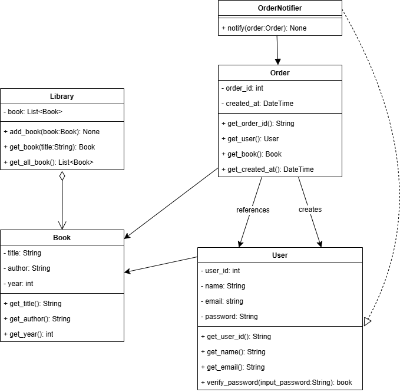

# Лабораторна робота 5  
## Розробка бібліотечного сервісу з використанням TDD та шаблонів проектування

## Завдання

### Частина 1: Проектування бібліотечного сервісу

#### Аналіз проблеми та дизайн
- **Основні класи системи:**
  - `Library`: представляє бібліотеку, що містить колекцію книг.
  - `Book`: представляє книгу з атрибутами (назва, автор, рік).
  - `User`: представляє користувача бібліотеки.
  - `Order`: представляє замовлення книги користувачем.
  - `OrderNotifier`: сповіщає бібліотекаря про нові замовлення.

#### Завдання:
- Розробіть **UML-діаграму класів**, яка відображає відносини між класами та їхні обов’язки.
- Реалізуйте початкову версію класів у пакеті  з ізоляцією бізнес-логіки від зовнішніх систем.

##  UML-діаграма

### Частина 2: Розробка системи за допомогою TDD

#### Реалізація функціоналу через TDD:
1. Почніть із модульних тестів для кожної функції перед реалізацією.
   
2. **Функціонал для тестування:**
   - Додавання книг до бібліотеки.
   - Реєстрація користувачів.
   - Створення замовлення книги.
   - Сповіщення бібліотекаря про нове замовлення.

3. Реалізуйте функціональність так, щоб тести проходили успішно.

#### Тестуйте різні сценарії:

- Реалізувати мінімум 10 модульних тестів для основних функцій і взаємодій.
* Успішне та неуспішне додавання книг.
* Обробка замовлень.
* Ситуації з порожньою бібліотекою або незареєстрованим користувачем.

#### Реалізовані тести

##### `test_book.py`

Тести для класу **Book**:

* **test\_get\_title** — перевіряє, чи метод `get_title()` повертає правильну назву книги.
* **test\_get\_author** — перевіряє, чи метод `get_author()` повертає правильного автора.
* **test\_get\_year** — перевіряє, чи метод `get_year()` повертає правильний рік видання.

##### `test_library.py`

Тести для класу **Library**:

* **test\_add\_book** — перевіряє, чи книга правильно додається до бібліотеки.
* **test\_get\_book\_found** — перевіряє пошук книги, яка є в бібліотеці.
* **test\_get\_book\_not\_found** — перевіряє пошук книги, якої немає (повинен повертати `None`).

##### `test_order.py`

Тести для класу **Order**:

* **test\_get\_order\_id** — перевіряє, чи повертається правильний ID замовлення.
* **test\_get\_user** — перевіряє, чи повертається правильний користувач замовлення.
* **test\_get\_book** — перевіряє, чи повертається правильна книга замовлення.
* **test\_get\_created\_at** — перевіряє, що дата створення замовлення повертається у правильному форматі (`datetime`).

##### `test_user.py`

Тести для класу **User**:

* **test\_get\_user\_id** — перевіряє правильність повернення ID користувача.
* **test\_get\_name** — перевіряє правильність повернення імені користувача.
* **test\_get\_email** — перевіряє правильність повернення email користувача.
* **test\_verify\_password\_correct** — перевіряє правильну перевірку пароля (коли пароль правильний).
* **test\_verify\_password\_incorrect** — перевіряє неправильну перевірку пароля (коли пароль невірний).

### Частина 3: Використання шаблонів проектування

#### Застосовуйте шаблони:

* **Singleton:** для керування єдиним підключенням до MongoDB.
* **Factory:** для створення об’єктів `Book` і `User`.
* **Шаблон Observer:** для сповіщення бібліотекаря про нові замовлення.

#### Напишіть тести для шаблонів:

- Реалізувати мінімум 10 тестів для реалізації шаблонів.
* Перевірка, що Singleton повертає єдиний екземпляр.
* Тести для Factory: створення правильних об’єктів.
* Тести для Observer: перевірка сповіщення бібліотекаря.

## Технічні вимоги

* **Мова програмування:** Python
* **Фреймворк для тестування:** pytest
* **База даних:** MongoDB
* **Бібліотека для роботи з MongoDB:** PyMongo
* **Інші технології:** Flask для RESTful API

## Вимоги

### Код системи:

* Реалізуйте класи та функціонал відповідно до структури **Domain, Ports, Adapters**.
* Використовуйте **TDD** для розробки.
* Застосовуйте шаблони **Singleton, Factory, Observer**.

### Тестування:

* Напишіть **щонайменше 10 модульних тестів** для перевірки:

  * Основних функцій (додавання книг, створення замовлень).
  * Взаємодії між компонентами (сповіщення про замовлення).
  * Роботи шаблонів проектування.

### Документація:

* Створіть **UML-діаграму класів**.
* Підготуйте звіт із підсумками тестів

## Очікувані результати

* Функціональний бібліотечний сервіс із реєстрацією користувачів, замовленням книг і сповіщенням бібліотекаря.
* Код, розроблений із використанням **TDD** і шаблонів проектування.
* Успішне проходження всіх тестів.

## Критерії оцінювання

* **30%** — Дотримання структури проєкту та технічного завдання.
* **20%** — Коректність реалізації функцій.
* **20%** — Використання шаблонів проектування (Singleton, Factory, Observer).
* **30%** — Якість, кількість і покриття модульних тестів.
